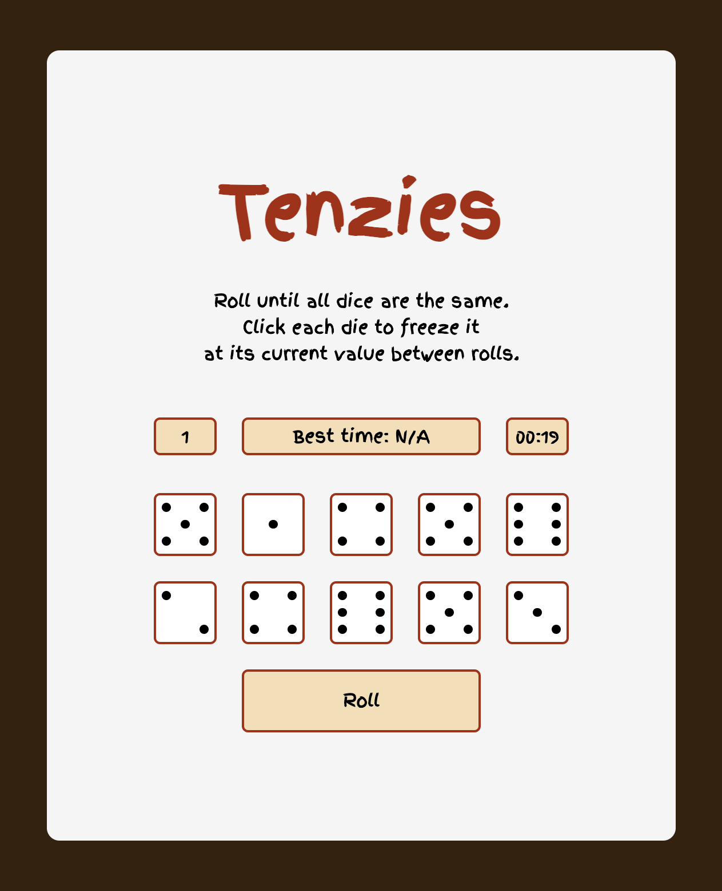

# 🎲 Tenzies Game

A fun and addictive dice game built with React! Try to match all dice to the same number by rolling strategically. Track your rolls, beat your best time, and challenge yourself to improve your record!

## 🚀 Features
- 🎲 **Interactive Gameplay** – Click on dice to freeze them and roll the rest.
- ⏱️ **Time Tracking** – See how fast you can complete the game.
- 🏆 **Best Time Record** – Compete against yourself to achieve a new best time.
- 💻📱 **Responsive Design** – Works on both desktop and mobile.
- 🎨 **Minimalistic & Fun UI** – A clean and engaging user interface.

## 📸 Screenshot



## 🛠️ Installation & Usage

1. **Clone the repository:**
   ```sh
   git clone https://github.com/your-username/tenzies-game.git
   cd tenzies-game
   ```

2. **Install dependencies:**
   ```sh
   npm install
   ```

3. **Run the app:**
   ```sh
   npm start
   ```

The app will open at `http://localhost:3000/` in your browser.

## 📜 How to Play
1. Click the **Roll** button to roll the dice.
2. Click on dice to **hold** them at their current value.
3. Keep rolling until **all dice** show the **same number**.
4. Try to win in the **shortest time**!

## 🔧 Technologies Used
- **React** – Frontend framework
- **JavaScript (ES6+)** – Core logic
- **CSS** – Styling
- **Google Fonts** – Custom typography

## 📄 License
This project is licensed under the **MIT License**. Feel free to use, modify, and distribute it.

## 🤝 Contributing
If you’d like to contribute, feel free to fork the repository and submit a pull request!

## 📩 Contact
For any questions or feedback, feel free to reach out:
- **GitHub:** [sevasmith](https://github.com/sevasmith)
- **Email:** seva.kavalenka@gmail.com
---
Enjoy the game and try to set a new record! 🎉